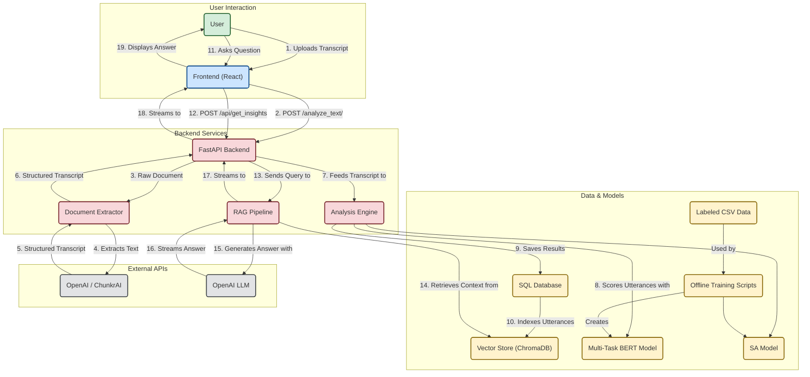

# work-performance
AI powered workplace performance tracking platform

## Pipeline Diagram

# Design Document: AI-Powered Workplace Performance Tracking Platform

  1. High-Level Overview

  This document outlines the design and architecture of an 
  AI-powered workplace performance tracking platform. The 
  platform analyzes meeting transcripts to provide insights 
  into team performance, individual contributions, and overall 
  communication dynamics.

  The system is designed as a microservices architecture, 
  consisting of a React frontend, a FastAPI backend, a Redis 
  cache, and an arq worker for asynchronous task processing. 
  The backend leverages a Retrieval-Augmented Generation (RAG) 
  pipeline to answer user questions and provide insights from 
  the analyzed data.

  2. Frontend

  The frontend is a single-page application (SPA) built with 
  React and TypeScript. It provides a user-friendly interface 
  for uploading meeting transcripts, viewing analysis results, 
  and querying the RAG pipeline.

  Components

   - `FileUpload`: Allows users to upload a meeting transcript 
     file to the backend for analysis.
   - `AnalysisDisplay`: Displays the analysis results, including 
     speaker-specific metrics and a timeline of the conversation.

   - `RAGQuery`: Provides a chat-like interface for users to ask 
     questions about the analyzed data. It streams the answers 
     from the backend, providing a real-time experience.

  Interaction with Backend

  The frontend communicates with the backend via a REST API. It 
  uses the fetch API to make requests to the following endpoints:

   - POST /analyze_text/: Uploads a transcript for analysis.
   - GET /analysis_status/{job_id}: Polls for the status of an 
     analysis job.
   - GET /analyses/{analysis_id}: Retrieves the results of a 
     specific analysis.
   - POST /api/get_insights: Sends a query to the RAG pipeline 
     and streams the response.

  3. Backend

  The backend is a FastAPI application that provides the core 
  functionality of the platform. It exposes a REST API for the 
  frontend and interacts with the database, the arq worker, and
   the RAG pipeline.

  API Endpoints

   - POST /analyze_text/: Accepts a transcript file, saves it, 
     and enqueues a background job for processing.
   - GET /analysis_status/{job_id}: Checks the status of a 
     processing job.
   - GET /analyses/: Returns a list of all completed analyses.
   - GET /analyses/{analysis_id}: Returns the detailed results 
     of a single analysis.
   - GET /api/trends: Provides trend data for specific metrics.
   - POST /api/get_insights: The main endpoint for the RAG 
     pipeline, which streams answers to user queries.

  4. Asynchronous Task Processing

  The platform uses arq, a Python task queue, to process 
  analysis jobs asynchronously. This prevents the backend from 
  being blocked by long-running tasks and improves the overall 
  responsiveness of the application.

  When a user uploads a transcript, the backend enqueues a 
  process_document_task to the arq worker. The worker then 
  performs the following steps:

   1. Document Extraction: Extracts the text from the uploaded 
      file.
   2. Analysis: Analyzes the text using a multi-task BERT model 
      to score utterances on various metrics.
   3. Database Storage: Saves the analysis results to the 
      database.
   4. Indexing: Indexes the utterances in the Chroma vector store 
      for the RAG pipeline.

  5. RAG Pipeline

  The RAG pipeline is the core of the platform's insights 
  generation capabilities. It uses a combination of retrieval 
  and generation to answer user questions about the analyzed 
  data. The pipeline is implemented using langgraph and 
  consists of the following steps:

   1. Load History: Loads the conversation history from Redis to 
      provide context for the current query.
   2. Classify Query: Classifies the user's query to determine 
      the type of analysis required (e.g., trend analysis, 
      comparison, root cause analysis).
   3. Retrieve Docs: Retrieves relevant documents (utterances) 
      from the Chroma vector store based on the user's query.
   4. Compute Aggregates: Computes aggregate metrics from the 
      retrieved documents to provide a quantitative summary.
   5. Generate Draft: Generates a draft answer using a large 
      language model (LLM) based on the retrieved documents and 
      computed aggregates.
   6. Format Answer: Formats the final answer, including a 
      narrative summary, bullet points, and citations to the 
      source documents.
   7. Save History: Saves the current query and answer to the 
      conversation history in Redis.

  The RAG pipeline is designed to be streaming-first, providing a
   real-time experience for the user.

  6. Data Model

  The application uses a SQL database (PostgreSQL) to 
  store the analysis results. The database schema is managed 
  using Alembic migrations. The main table is the utterances 
  table, which stores the following information for each 
  utterance in a meeting:

   - id: The primary key.
   - text: The text of the utterance.
   - speaker: The speaker of the utterance.
   - timestamp: The timestamp of the utterance.
   - predictions: A JSON field containing the scores from the 
     analysis.
   - analysis_id: A foreign key to the analyses table.

  7. Deployment

  The application is deployed using Docker and docker-compose. 
  The docker-compose.yml file defines the following services:

   - frontend: The React frontend.
   - backend: The FastAPI backend.
   - migrate: A service to run database migrations.
   - redis: A Redis instance for caching and the arq task queue.
   - arq_worker: The arq worker for asynchronous task 
     processing.

  This multi-container setup allows for easy scaling and 
  management of the different components of the application.

# TO DO
- visualization chart /graph tool - 
- paragraph of work done so far -  
- hosting - 
- Observability
- chat history
- sanitize response
- optimize AI section, evals, streamlit setup
- getting data from Polaris

