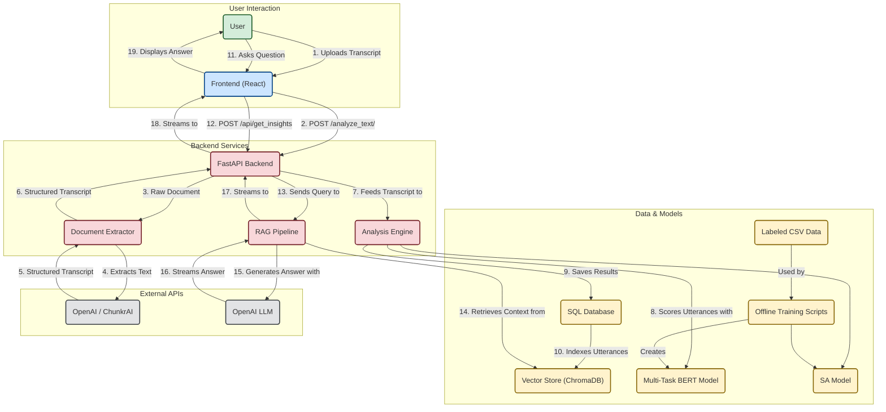

# work-performance
AI powered workplace performance tracking platform

## Pipeline Diagram

```mermaid
graph TD
    subgraph User Interaction
        User("User")
        Frontend("Frontend (React)")
    end

    subgraph Backend Services
        BackendApi("FastAPI Backend")
        DocExtractor("Document Extractor")
        AnalysisEngine("Analysis Engine")
        RAG_Pipeline("RAG Pipeline")
    end

    subgraph Data & Models
        Database("SQL Database")
        VectorStore("Vector Store (ChromaDB)")
        BertModel("Multi-Task BERT Model")
        SAModel("SA Model")
        TrainingScripts("Offline Training Scripts")
        TrainingData("Labeled CSV Data")
    end

    subgraph External APIs
        OpenAI_Chunkr("OpenAI / ChunkrAI")
        OpenAI_LLM("OpenAI LLM")
    end

    %% Data Ingestion and Analysis Flow
    User -- 1. Uploads Transcript --> Frontend
    Frontend -- 2. POST /analyze_text/ --> BackendApi
    BackendApi -- 3. Raw Document --> DocExtractor
    DocExtractor -- 4. Extracts Text --> OpenAI_Chunkr
    OpenAI_Chunkr -- 5. Structured Transcript --> DocExtractor
    DocExtractor -- 6. Structured Transcript --> BackendApi
    BackendApi -- 7. Feeds Transcript to --> AnalysisEngine
    AnalysisEngine -- 8. Scores Utterances with --> BertModel
    AnalysisEngine -- " " --> SAModel
    AnalysisEngine -- 9. Saves Results --> Database
    Database -- 10. Indexes Utterances --> VectorStore

    %% RAG Query Flow
    User -- 11. Asks Question --> Frontend
    Frontend -- 12. POST /api/get_insights --> BackendApi
    BackendApi -- 13. Sends Query to --> RAG_Pipeline
    RAG_Pipeline -- 14. Retrieves Context from --> VectorStore
    RAG_Pipeline -- 15. Generates Answer with --> OpenAI_LLM
    OpenAI_LLM -- 16. Streams Answer --> RAG_Pipeline
    RAG_Pipeline -- 17. Streams to --> BackendApi
    BackendApi -- 18. Streams to --> Frontend
    Frontend -- 19. Displays Answer --> User

    %% Model Training Flow
    TrainingData -- Used by --> TrainingScripts
    TrainingScripts -- Creates --> BertModel
    TrainingScripts -- " " --> SAModel

    %% Styling
    classDef userStyle fill:#d4edda,stroke:#155724,stroke-width:2px
    class User userStyle

    classDef frontendStyle fill:#cce5ff,stroke:#004085,stroke-width:2px
    class Frontend frontendStyle

    classDef backendStyle fill:#f8d7da,stroke:#721c24,stroke-width:2px
    class BackendApi,DocExtractor,AnalysisEngine,RAG_Pipeline backendStyle

    classDef dataStyle fill:#fff3cd,stroke:#856404,stroke-width:2px
    class Database,VectorStore,BertModel,SAModel,TrainingScripts,TrainingData dataStyle

    classDef externalStyle fill:#e2e3e5,stroke:#383d41,stroke-width:2px
    class OpenAI_Chunkr,OpenAI_LLM externalStyle
```
